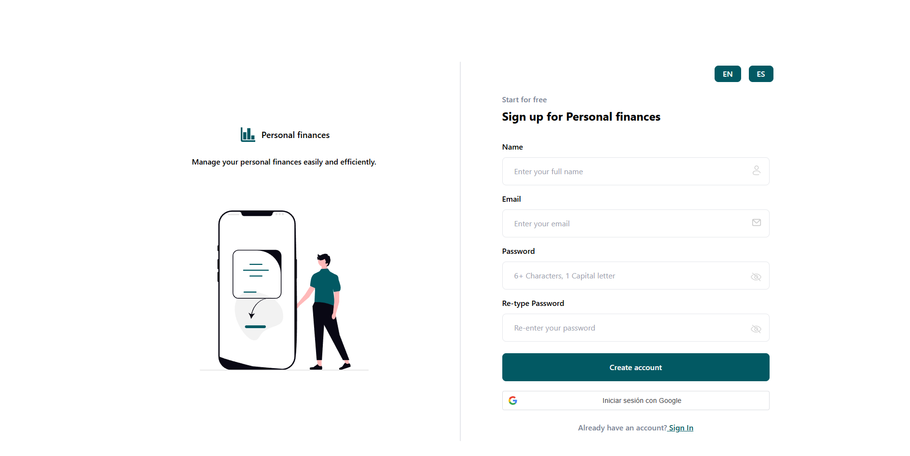

# 💸 Personal Finance Application

This app allows users to manage their financial transactions, securely register and log in, including authentication with Google.

---

## 📝 Overview

The application enables users to:

- Register and log in with email and password
- Log in using their Google account via OAuth 2.0
- Manage financial transactions by adding, viewing, and deleting income or expenses
- Update their profile and securely change their password
- Interact with a friendly, modern, and responsive interface
- **Includes automated testing with Jest and React Testing Library to ensure component reliability and robust UI behavior**

---

## ⚙️ Architecture

The project is divided into two main parts:

### Backend

- Built with **Node.js**, **Express**, and **MySQL**
- Provides RESTful endpoints for authentication, user management, and transactions
- Handles password encryption with **bcrypt** and authentication using **JWT**
- Supports login via Google OAuth 2.0

### Frontend

- Built with **React** and **Vite**
- Uses the **fetch API** to communicate with the backend
- Styled with **Tailwind CSS** for a modern and responsive UI
- Supports authentication flows and transaction management
- Includes language buttons to switch the interface between multiple languages dynamically
- **Includes comprehensive unit and integration tests using Jest and React Testing Library to maintain high code quality and prevent regressions**

---

## 🚀 How to Use

1. Set up and start the backend server (see the backend README)
2. Set up and start the frontend client (see the frontend README)
3. Register or log in using your email/password or Google account
4. Start managing your financial transactions easily and securely
5. Run the tests with `npm test` or `yarn test` in the frontend directory to verify component functionality

---

## 🔧 Technologies

- Node.js, Express, MySQL, JWT, bcrypt, Google OAuth
- React, Vite, Tailwind CSS, Fetch API
- **Jest, React Testing Library**

---

---

---

---

